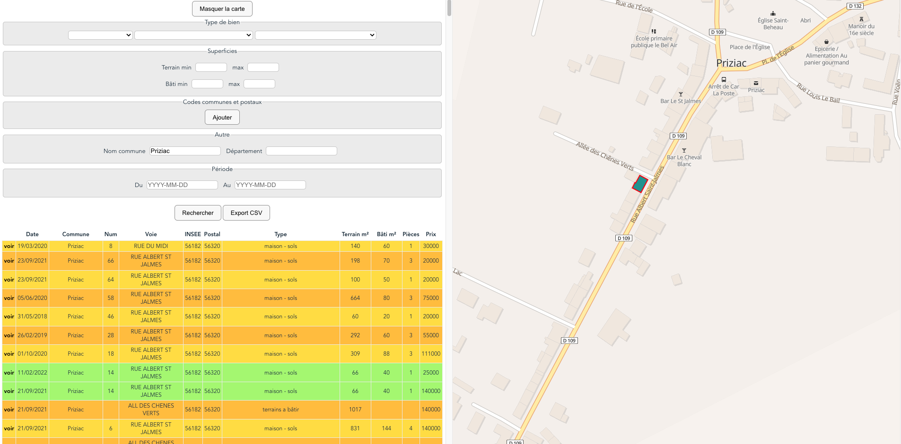

# YADVF

Un nième outil permettant d'exploiter les données de Demandes de Valeur Foncière fournies par la DGFiP, à l'exception de celles concernant l'Alsace, la Moselle et Mayotte.

Vous devez disposer, en ligne de commande :

- de la toolchain go
- de sqlite3
- optionnellement de yarn pour le développement Svelte

## Utilisation

- `git clone https://github.com/cgimenez/yadvf`
- `cd yadvf`
- `go run .` (ou `go build` puis `./yadvf`)

à la première utilisation l'application va télécharger l'ensemble des données disponibles depuis 2017 et les intégrer dans la base de données locale. Cette opération peut prendre une dizaine de minutes, en fonction de la vitesse de votre connexion et de la puissance de votre ordinateur.

Une fois les données intégrées, lancez votre navigateur de prédilection et ouvrez ouvrez l'url
http://127.0.0.1:8000

## Développement

Si vous désirez modifier la partie cliente de l'application, développée avec Svelte,
installez les dépendances : `cd www && yarn`

**puis**

- `yarn build --watch`
- modifiez le code source Svelte et rafraichissez la page dans votre navigateur

**ou**

- `cd www`
- `yarn dev`
- ouvrez http://127.0.0.1:8002 (l'application Go doit être lancée)
- modifiez le code source Svelte, le mécanisme HMR rechargera le module correspondant dans votre navigateur

## Notes

- cette application n'a pas la prétention d'être exploitable en production et il n'y a aucun mécanisme de pagination des réponses, donc...
- l'affichage des données géographique utilise les serveurs de l'IGN, qui répondent parfois lentement, parfois pas du tout
